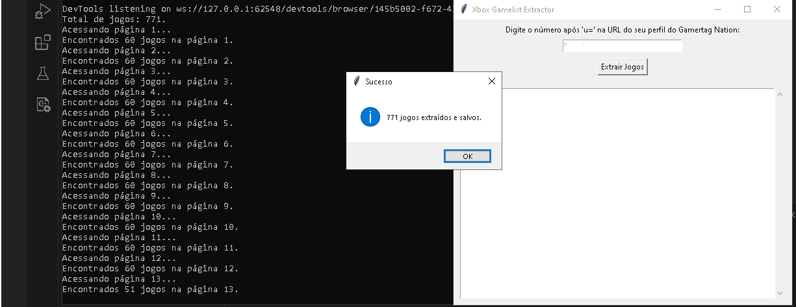

# Xbox Gamelist Extractor

**Xbox Gamelist Extractor** is a tool designed to help gamers who have hundreds of games in their Xbox account quickly generate a simple text list of all their games. This saves time, avoiding the need to manually type each game one by one.

## Features
- Extracts the list of games from your Xbox account profile by gamertagnation.
- Saves the list of games in a `.txt` file for easy access.
- Simple and user-friendly interface with Tkinter.

## How to Use
1. Download the latest release. A compiled exe can be found in the dist folder.
2. Make sure you have `chromedriver.exe` in the same folder as the `.exe` file (download it from [here](https://sites.google.com/a/chromium.org/chromedriver/)).
3. Double-click on the `main.exe` to run the program.
4. Enter your Xbox Gamertag Nation profile ID when prompted (read the txt file).
5. The tool will extract your game list and save it as a `.txt` file.

## Requirements
- Google Chrome
- Chrome WebDriver (`chromedriver.exe`)

## License
This project is licensed under the MIT License.
---

# Xbox Gamelist Extractor

**Xbox Gamelist Extractor** é uma ferramenta projetada para ajudar gamers que têm centenas de jogos em suas contas do Xbox a gerar rapidamente uma lista simples de texto com todos os seus jogos. Isso economiza tempo, evitando a necessidade de digitar manualmente cada jogo um por um.

## Funcionalidades
- Extrai a lista de jogos do perfil da sua conta do Xbox a partir do site gamertagnation.
- Salva a lista de jogos em um arquivo `.txt` para fácil acesso.
- Interface simples e amigável com Tkinter.

## Como Usar
1. Baixe a versão mais recente, o exe compilado se encontra na pasta dist.
2. Certifique-se de que o `chromedriver.exe` esteja na mesma pasta que o arquivo `.exe` (baixe de [aqui](https://sites.google.com/a/chromium.org/chromedriver/)).
3. Dê um duplo clique no arquivo `main.exe` para executar o programa.
4. Insira o ID em numeros do seu perfil no Xbox Gamertag Nation quando solicitado.
5. A ferramenta irá extrair sua lista de jogos e salvá-la em um arquivo `.txt`.

### Captura de Tela

## Requisitos
- Google Chrome
- Chrome WebDriver (`chromedriver.exe`)

## Licença
Este projeto está licenciado sob a Licença MIT .
